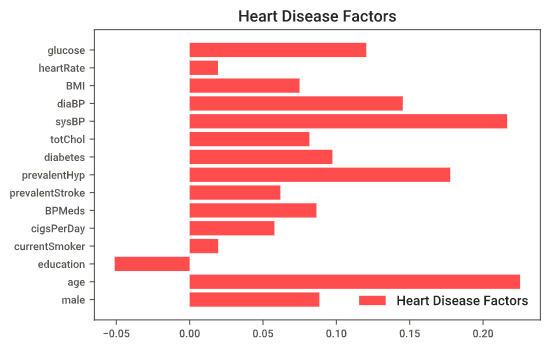
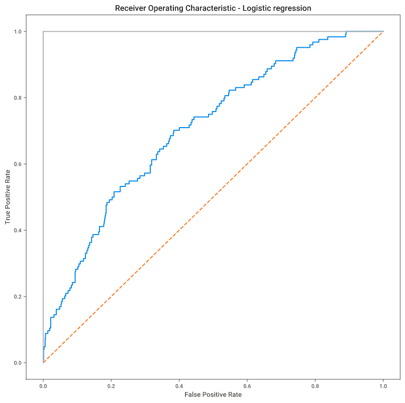
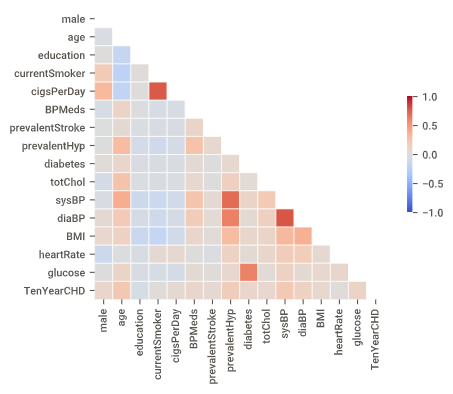

# Heart Disease Prediction

Today heart disease has been a main threaten of human's health. According to World Health Organization, 12 million deaths occur worldwide, every year due to Heart diseases. If heart disease can be predicted by bodys' indicators, many people can be saved.
This project tries to generate a logistic model which can predict the most relevant/risk factors of heart disease as well as predict the overall risk by using [framingham_heart_disease.csv](framingham_heart_disease.csv)

## Modeling
[See Jupyter Notebook File](heart-attack-prediction-with-eda-and-visualization.ipynb)
## Sample Visualization
[See SweetViz Report](SWEETVIZ_REPORT.html)
## Database
| Column Name        | Data Type           | Description  |
| ------------- |:-------------:| -----:|
| male      | int(bool) | 0 for female, 1 for male |
| age      | int      |  Age at exam time. |
| education | int      |    1 = Some High School;   2 = High School or GED;    3 = Some College or Vocational School;    4 = college   |
|currentSmoker|int(bool)| 0 for non-smoker, 1 for smoker|
|cigsPerDay| int | number of cigarettes smoked per day (estimated average)|
|BPMeds| int(bool) |0 = Not on Blood Pressure medications;  1 = Is on Blood Pressure medications|
|prevalentStroke| int(bool)||
|prevalentHyp|int(bool)||
|diabetes|int(bool)|0 = No; 1 = Yes|
|totChol|int|mg/dL|
|sysBP|float|mmHg|
|diaBP|float|mmHg|
|BMI|float|Body Mass Index calculated as: Weight (kg) / Height(meter-squared)|
|heartRate|int|Beats/Min (Ventricular)|
|glucose|int|mg/dL|
|TenYearCHD|int(bool)||

## Logistic Regression without PCA

### Factors

1. Risk has a positive correlation with age
2. Males has higher risk than famales.
3. Smoking is dangerous for Heart Disease.

### Precision

accuracy score is 0.858491   
Precision score:  0.6428571428571429   
Recall score:  0.07258064516129033   
roc_auc_score for Logistic Regression:  0.7063469078595616   

### ROC Curve

## Logistic Regression with PCA
### Correlationships

### Precision
accuracy score is 0.860849   
Precision score:  0.7142857142857143   
Recall score:  0.08064516129032258   
roc_auc_score for Logistic Regression:  0.7042973623240065   
### ROC Curve

